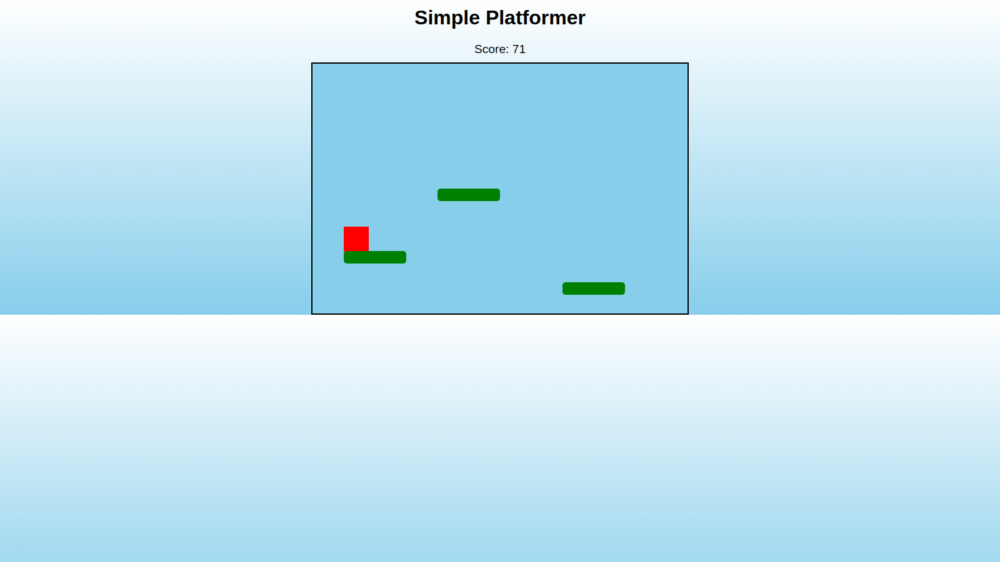

# 🌐 m223rx – Simple Platformer Web Game

---

## 🚀 Features  

- **Modern, Responsive Design**
Built with clean HTML, CSS, and JS to look great on desktop and mobile.

- **Smooth Player Movement**  
Move left and right with arrow keys or A/D keys, with natural acceleration and friction.

- **Jumping & Gravity**  
Press Space, W, or Up arrow to jump. Realistic gravity ensures smooth falling and landing.

- **Platform Collision Detection**  
Land safely on platforms without falling through. Multiple platforms provide challenges and variety.

- **Score Tracking**  
Distance traveled is tracked and displayed in real-time for added challenge.

- **Game Over & Restart**  
Restart the game instantly with a visible Game Over screen and restart button.

- **Sound Effects**  
Jump, land, and game over sounds enhance the gameplay experience.

---

## 🛠 Tech Stack

- **Frontend:**
  - [HTML5](https://developer.mozilla.org/en-US/docs/Web/HTML) – semantic structure  
  - [CSS3](https://developer.mozilla.org/en-US/docs/Web/CSS) – styling  
  - [JavaScript](https://developer.mozilla.org/en-US/docs/Web/JavaScript) – game logic, physics, and interactions

- **Deployment:**
  - Works perfectly with [GitHub Pages](https://pages.github.com/), [Netlify](https://www.netlify.com/), or any static hosting service.

---

## ⚡ Usage

1. **Clone the repository:**

   git clone https://github.com/m223rx/Simple-Platformer.git

   cd Simple-Platformer

2. **Open index.html in your browser**

3. **Customize content**

    Replace the player image in assets/images/ with your own sprite.

    Add or reposition platforms in index.html or via CSS.

    Replace sounds in assets/sounds/ for custom jump, land, and game over effects.

4. **Play:**

    Move left/right: Arrow keys or A/D

    Jump: Space, Up arrow, or W

    Restart: Click the Restart button after Game Over

5. **Deploy:**

    Push to GitHub and enable GitHub Pages or upload to your hosting platform.

## 🎨 Customization

Change colors, fonts, and spacing in style.css to match your style or theme.

Add new platform types (moving, breakable, or hazardous) in index.html and JS.

Enhance background with images, gradients, or parallax layers.

Modify scoring system or add collectibles to make gameplay more engaging.

## 💡 Future Enhancements

Add enemies, coins, or hazards to increase difficulty.

Implement multiple levels and checkpoints.

Animated player sprite for walking, jumping, and idle states.

Mobile-friendly controls with on-screen buttons.

Particle effects for jumps, landings, and game over.

Dark/Light mode or customizable themes.

## 👨‍💻 Developer
m223rx – 2025

© 2025 m223rx. All rights reserved.

---